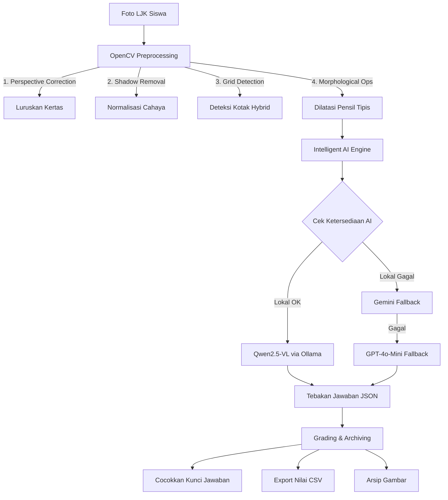

# Nikto_OCR: Intelligent LJK Scanner

📝 NIKTO_OCR adalah sistem pemindai Lembar Jawaban Komputer (LJK) berbasis Computer Vision dan Vision Language Models (VLM). Proyek ini menggabungkan kekuatan preprocessing OpenCV untuk deteksi struktur grid dengan kecerdasan AI lokal (Ollama/Qwen2.5-VL) serta fallback cloud (Gemini/OpenAI) untuk akurasi pembacaan tulisan tangan yang tinggi.

Sistem ini dirancang untuk berjalan efisien di lingkungan WSL2 atau server Linux, dengan dukungan integrasi Telegram Bot untuk kemudahan penggunaan jarak jauh.

## 🌟 Fitur Utama

- Hybrid AI Engine: Menggunakan model lokal Qwen2.5-VL via Ollama sebagai mesin utama, dengan fallback otomatis ke Google Gemini atau OpenAI GPT-4o-mini jika terjadi kegagalan.
- Advanced Preprocessing: Pipeline OpenCV untuk pelurusan perspektif (perspective correction), penghilangan bayangan, dan dilatasi morfologis khusus untuk tulisan pensil tipis.
- Telegram Integration: Bot Telegram interaktif untuk mengirim foto LJK dan menerima hasil scan secara real-time.
- Web Dashboard: Antarmuka berbasis Flask untuk monitoring dan konfigurasi kunci jawaban.
- Data Privacy: Gambar diproses secara lokal atau melalui API terenkripsi, dengan pembersihan file sementara (auto-garbage collection) setelah proses selesai.

## 🏗️ Arsitektur Sistem

Alur kerja Nikto-OMR terdiri dari tiga tahap utama:



## 📦 Struktur Direktori

```txt
.
├── ai_engine.py          # Orkestrator AI (Singleton & Logika Fallback)
├── api_keys.py           # Manajemen pengambilan API Key dari Environment
├── config_ai.py          # Konfigurasi global preferensi mesin AI aktif
├── gemini_ocr.py         # Integrasi API Google GenAI & Wrapper Class
├── kamus_visual.py       # Pengecekan berbasis Template Matching (Kamus Huruf)
├── local_ocr.py          # Interface Ollama lokal dengan Regex JSON Extraction
├── ocr.py                # Server Flask utama & Core Computer Vision Pipeline
├── openai_ocr.py         # Integrasi API OpenAI & Wrapper Class dengan Rate Limiter
├── telegram_bot.py       # Interface Bot Telegram dengan pembersihan otomatis
├── requirements.txt      # Daftar dependensi modul Python
├── .env                  # File konfigurasi rahasia (JANGAN DI-COMMIT)
└── kunci_jawaban/        # Direktori penyimpanan kunci jawaban
    └── SMA_10_A.txt      # Contoh format: nomor,jawaban
```

## 🚀 Panduan Instalasi & Setup

### 1. Prasyarat Sistem

- Python 3.10+
- Ollama: Terinstal dan service berjalan (untuk AI Lokal).
- Tesseract OCR: (Opsional) Untuk fallback dasar.
- WSL2 (Disarankan): Untuk performa optimal di Windows.

### 2. Unduh Model AI Lokal

Pastikan service Ollama telah berjalan, lalu unduh model Vision Qwen2.5:

```bash
ollama pull qwen2.5vl:3b
```

### 3. Kloning Repositori & Install Dependensi

```bash
git clone https://github.com/Maull123es/NIKTO_OCR.git
```
```bash
cd NIKTO_OCR
```
```bash
pip install -r requirements.txt
```

### 4. Konfigurasi Environment (.env)

Buat file .env di direktori root dan isi dengan kredensial Anda:

```env
# Telegram Bot Token (Dapatkan dari @BotFather)
TELEGRAM_BOT_TOKEN=your_telegram_bot_token_here

# Konfigurasi AI Backend
AI_BACKEND=local          # Pilihan: local, gemini, openai
OLLAMA_MODEL=qwen2.5vl:3b

# Cloud API Keys (Fallback)
GEMINI_API_KEY=your_gemini_api_key_here
OPENAI_API_KEY=your_openai_api_key_here
```

### 5. Setup Kunci Jawaban

Buat file teks di folder kunci_jawaban/ (misal: SMA_10_A.txt) dengan format:

```txt
1,A
2,C
3,B
...
50,E
```

## 💻 Cara Menjalankan Aplikasi

### Opsi 1: Web Dashboard (Flask)

Menjalankan server web untuk scanning manual dan manajemen data.

```bash
python ocr.py
```

Akses dashboard di browser: [http://localhost:5001](http://localhost:5001)

### Opsi 2: Telegram Bot Scanner

Menjalankan bot untuk scanning praktis via chat.

```bash
python telegram_bot.py
```

Kirim foto LJK ke bot Telegram Anda, dan tunggu hasil analisisnya.

## 🔒 Keamanan & Kebijakan Data

1. Isolasi Kredensial: Semua API Key disimpan di .env yang diabaikan oleh Git (.gitignore).
2. Auto-Cleanup: Gambar sementara hasil crop atau download Telegram akan dihapus otomatis setelah proses grading selesai untuk menghemat penyimpanan SSD.
3. Local First: Prioritas pemrosesan dilakukan secara lokal menggunakan Ollama untuk meminimalkan ketergantungan pada koneksi internet dan biaya API.

## 📄 Lisensi

Proyek ini didistribusikan di bawah lisensi MIT License. Anda bebas menggunakan, memodifikasi, dan membagikan ulang kode ini untuk kepentingan akademis maupun komersial dengan tetap mencantumkan atribusi penulis asli.

Catatan Pengembangan: Proyek ini terus dikembangkan. Jika Anda menemukan bug atau memiliki saran fitur, silakan buka Issue di repository GitHub ini.

Made With Love❤️